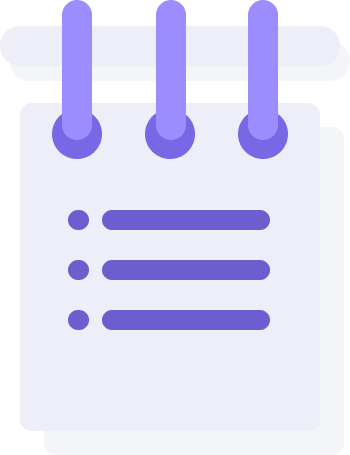

<!-- PROJECT LOGO -->
 

  

<h3 align="center">To-do Lists and Notes</h3>

  

    The fullstack web application version of my first To-do List.
     
     
    <a href="https://todolists-and-notes.onrender.com/">View Demo</a>
  

<!-- ABOUT THE PROJECT -->
## About The Project

This is my second version of To-do List as well as my first fullstack application with user authentication. This version uses mongoDB for storing the data. Aside from using database and user authentication, it pretty much has the same functionalities with the frist version and additional functionality such as editing and saving a note. I've also tweaked the style for mobile optimization.

### Built With

* [Sass](https://sass-lang.com/)
* [Vue.js](https://vuejs.org/)
* [Node.js](https://nodejs.org/en/)
* [MongoDB](https://www.mongodb.com/)
* [Mongoose](https://mongoosejs.com/)
